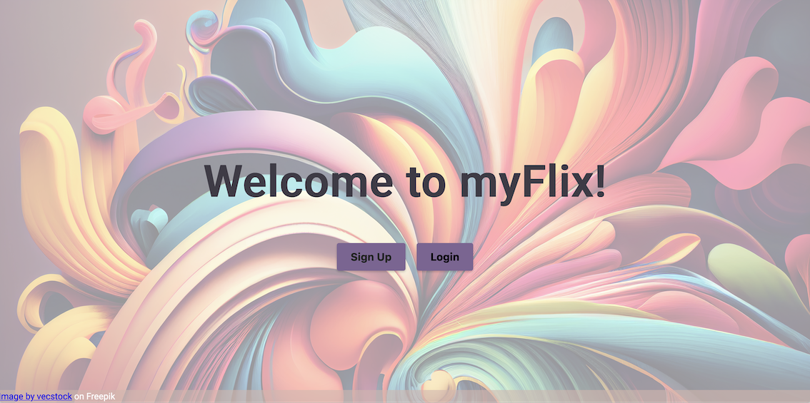
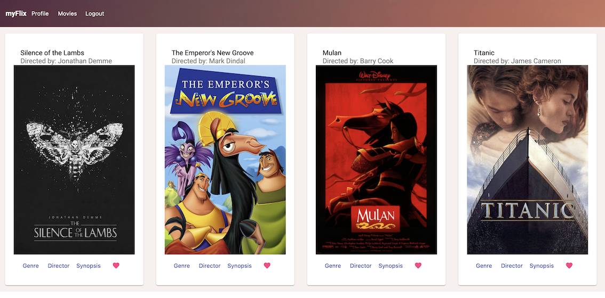
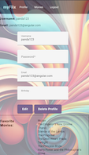
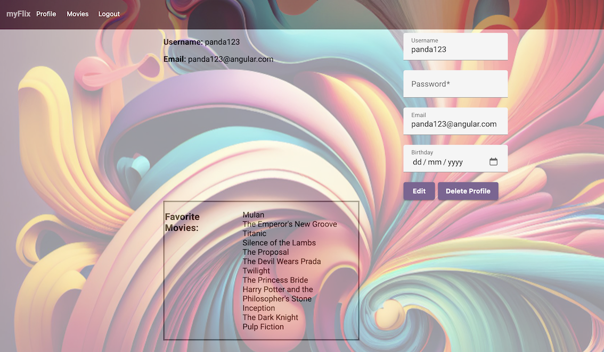

# Angular mFlix App

## Project Description

This project is a single-page, responsive movie app built with Angular, featuring routing and multiple interface views. It serves as the client-side component for an existing server-side flixApp API, facilitating user requests and rendering server responses through various interface views, and includes documentation and handoff deliverables.

## Table of Contents

- [Screenshots](#screenshots)
- [Key Features](#key-features)
- [Link](#link)
- [Technical Requirements](#technical-requirements)
- [Development](#development)
- [Further Help](#further-help)

## Screenshots

|              Web View              |                Mobile View                 |
| :--------------------------------: | :----------------------------------------: |
|  |  |
|    |  |
|  |

## Key Features

- Welcome View: Allows users to log in or register an account.
- All Movies View: Displays a list of all movies.
- Movie View: Shows detailed movie information and offers access to director and genre details.
- Director View: Displays information about the director of a selected movie.
- Genre View: Presents information about a selected movie genre.
- Synopsis View: Presents a brief description of the movie.

## Link

https://keylan1.github.io/mFlixApp-Angular

## Technical Requirements

- Angular (version 9 or later)
- Node.js and npm
- User registration and login forms
- Angular Material for design
- Code comments using Typedoc
- Technical documentation using JSDoc
- Hosting on GitHub Pages

## Development

### Development server

This project was generated with [Angular CLI](https://github.com/angular/angular-cli) version 16.2.1.

To run the development server, use the following commands:

```bash
git clone <repository-url>
cd MyFlixAngularClient
npm install
ng serve
```

Run `ng serve` for a dev server. Navigate to http://localhost:4200/. The application will automatically reload if you change any of the source files.
Code scaffolding

Run `ng generate component component-name` to generate a new component.

### Build

Run `ng build` to build the project. The build artifacts will be stored in the dist/ directory.

## Further help

To get more help on the Angular CLI use ng help or go check out the Angular CLI Overview and Command Reference page.

```

```
